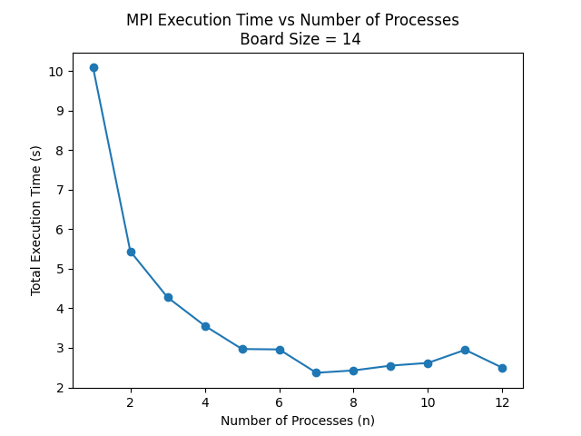
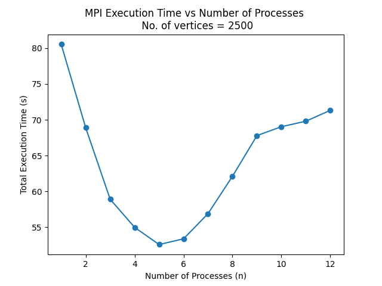
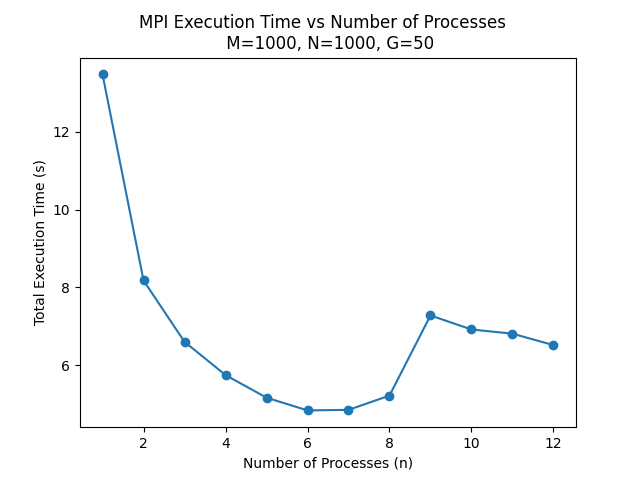

# Distributed Systems: Assignment - 1

**Name:** Jaffrey Joy  
**Roll no:** 2022201006

## Question 1B - NQueens
- ### Premise
    Board size is denoted by $n$  
    No. of processes is denoted by $p$  
    A core is denoted by $c$
- ### Time Complexity
    We are parallelizing based on the initial placement of the queen i.e. if the board is of size $n$ the maximum we can parallelize is by placing the queen on each row in the first column and then checking for further columns (this can be distributed to $n$ processes if available i.e. in each process for the first column the queen starts on a different row) giving us a time complexity of $O((n-1)!)$, if every process can be scheduled on a separate core.  
    Based on the distribution among the processes it would then be: $$O\left(\left\lceil \frac{n}{p} \right\rceil *(n-1)!\right) : n \geq p, \forall p \ \exists c \ \land \neg\exists p \exists p' : Core(p)=Core(p')  $$
    > The above _such that_ condition applies for the following questions' time complexity as well. (So we will be avoiding that verbosity henceforth for the sake of brevity)
- ### Message complexity
    The initial Broadcast message is a single integer for board size.  
    Similarly, for the `MPI_Reduce` operation only an integer is passed by all processes.  

- ### Space requirements
    Each process requires $O(n^2)$ space.
- ### Performance scaling
    

## Question 2 - Floyd Warshall
- ### Premise
    No. of vertices is denoted by $V$.  
    No. of processes is denoted by $p$
- ### Time Complexity
    We are parallelizing based on the fact that each row's relaxation is independent of the other. So we can distribute the rows equally among the processes and relax them concurrently. A time complexity of $O(V^2)$ can be achieved if every process can be scheduled on a separate core and each row is assigned to a single process.  
    Based on the distribution among the processes it would then be:
    $$O\left(\left\lceil \frac{V}{p} \right\rceil *V^2\right) $$
- ### Message complexity
    Initially, a broadcast message is sent for $V$  
    Then around $\dfrac{V}{p}$ no. of rows are sent to the respective process by the root in a single message.  
    **All bulk sends and receives by the root are non-blocking.**  
    The total number of messages sent for a run would be around $p$ and the maximum size of a message would be around $\left(\dfrac{V}{p}*V\right)$

- ### Space requirements
    The root process requires $O(V^2)$ space.  
    Rest of the processes require $O\left(\left\lceil \dfrac{V}{p} \right\rceil * V \right)$ space. 
    The smallest unit of a message being sent is `MPI_INT`.
- ### Performance scaling
    

    The fall and rise of the execution time are mainly due to the unavailability of hardware cores to accommodate the increasing no. of processes, because of which some processes may have to execute sequentially. 
    > The machine on which the program was run has $8$ physical cores.

## Question 3 - Game of Life
- ### Premise
    No. of rows is denoted by $r$.  
    No. of columns is denoted by $c$.  
    No. of generations is denoted by $g$.  
    No. of processes is denoted by $p$
- ### Time Complexity
    We create horizontal slices based on the no. of processes available. We also consider if no. of rows is greater no. of than cols or vice versa and perform a transpose so that work is divided more proportionately among the various processes. A time complexity of $O(g*\text{min}(r,c))$ can be achieved if every process can be scheduled on a separate core and each row is assigned to a single process.  
    Based on the distribution among the processes it would then be:
    $$O\left(g*\left\lceil \frac{\text{max}(r,c)}{p} \right\rceil * \text{min}(r,c) \right) $$
- ### Message complexity
    Initially, $3$ broadcast messages are sent for $r$, $c$ and $g$.  
    Then around $\dfrac{\text{max}(r,c)}{p}$ no. of rows are sent to the respective process by the root in a single message.  
    **All bulk sends and receives by the root are non-blocking.**  
    The total number of messages sent for a run would be around $p$ and the maximum size of a message would be around $\left(\left(\dfrac{\text{max}(r,c)}{p}+2\right)*\text{min}(r,c)\right)$  
    > The extra $2$ is because every slice would need the upper row of its topmost row and the lower row of its bottommost row to determine the next state of a cell, as those $2$ rows would contain its neighbours.

- ### Space requirements
    Root process requires $O(r*c)$ space.  
    Rest of the processes require $O\left(\left\lceil \dfrac{\text{max}(r,c)}{p} \right\rceil * \text{min}(r,c) \right)$ space.  
    The smallest unit of a message being sent is `MPI_INT`.
- ### Performance scaling
    

    The fall and rise of the execution time are mainly due to the unavailability of hardware cores to accommodate the increasing no. of processes, because of which some processes may have to execute sequentially. 
    > The machine on which the program was run has $8$ physical cores.

## Misc
 - Scripts used to generate performance scaling metrics are present in `./_scripts`
